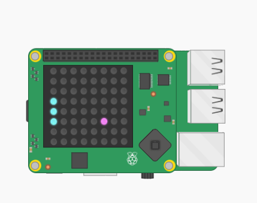

# What you will need #
 ## Hardware ##
 <ul>
  <li>Raspberry Pi</li>
  <li>Sense HAT (if you don't have one use <a href="https://trinket.io/sense-hat">Sense Hat emulator</a>)</li>
 </ul>
 
 ## Software ##
 <ul>
<li>Python 3</li>
  <li>Sense HAT for Python 3</li>
  </ul>
  
  If you have a Sense HAT, attach it to your Raspberry Pi.
  If you do not have a Sense HAT, you can create the project using the <a href="https://trinket.io/sense-hat">Sense Hat emulator</a>.
   
   

